# Relay-Monitoring Application — Architecture & Data Flow

## 1. High-Level System Architecture

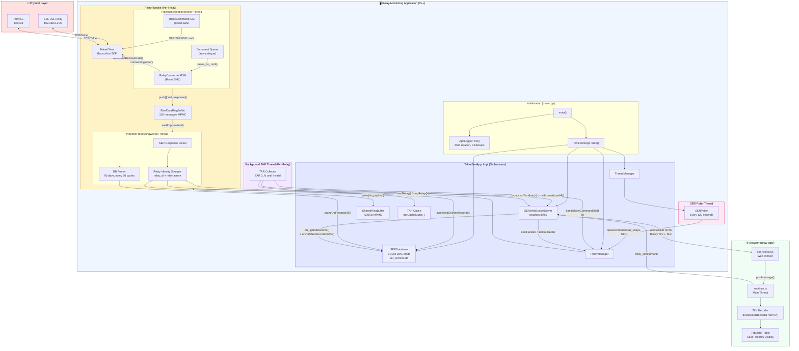

---

## 2. Per-Relay Pipeline — Detailed Data Flow

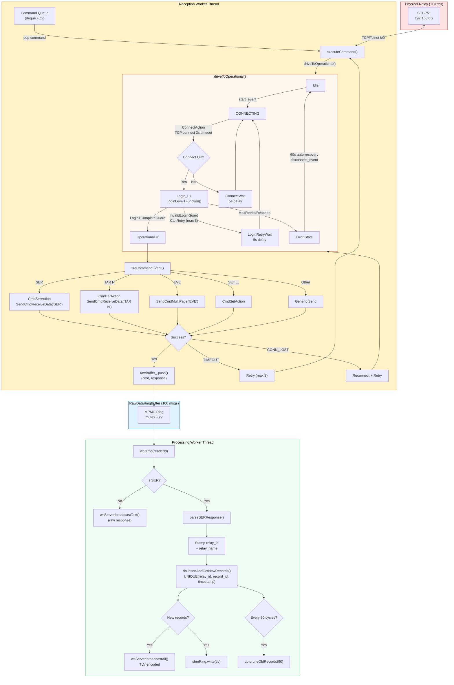

---

## 3. WebSocket Communication — Browser ↔ Server

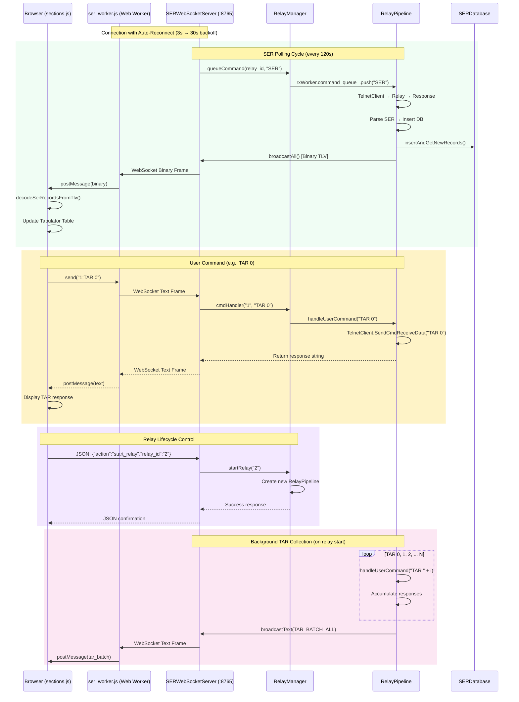

---

## 4. Thread Architecture & Synchronization

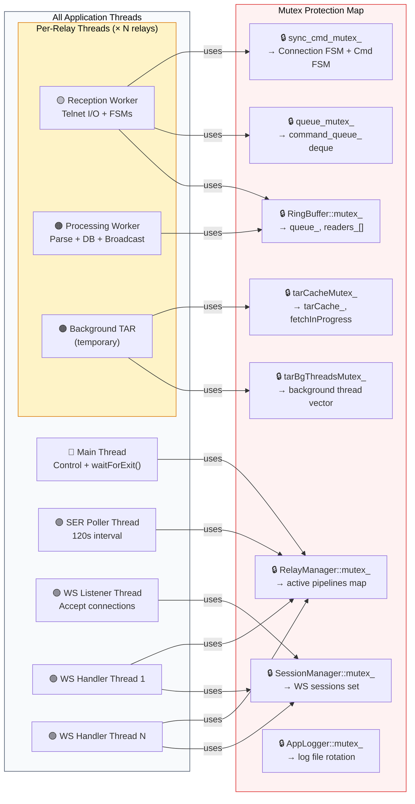

---

## 5. Error Recovery & Auto-Heal Flow

```mermaid
stateDiagram-v2
    [*] --> Idle

    state "Connection Lifecycle" as CL {
        Idle --> Connecting: start_event

        Connecting --> Login_L1: Connect OK ✅
        Connecting --> ConnectWait: Connect FAIL ❌

        ConnectWait --> Connecting: 5s delay<br/>(unlimited retries)

        Login_L1 --> Operational: Login OK ✅
        Login_L1 --> LoginRetryWait: Invalid Login<br/>(retries ≤ 3)
        Login_L1 --> Error: Max Retries<br/>Reached (3)

        LoginRetryWait --> Connecting: 5s delay

        Operational --> Idle: disconnect_event<br/>(connection lost)

        Error --> Idle: 60s auto-recovery<br/>disconnect_event
    end

    state "Command Execution" as CE {
        state "In Operational State" as InOp
        InOp --> ExecuteCmd: command from queue

        ExecuteCmd --> Success: Response OK
        ExecuteCmd --> RetryCmd: TIMEOUT<br/>(max 3 retries)
        ExecuteCmd --> Reconnect: CONN_LOST

        RetryCmd --> ExecuteCmd: retry
        Reconnect --> Connecting: driveToOperational()
        Success --> InOp: next command
    end

    state "Worker Thread Recovery" as WR {
        state "Thread Running" as TR
        TR --> ExceptionCaught: Any exception
        ExceptionCaught --> TR: 5s backoff<br/>auto-restart
    }

    note right of Error
        After 60s, automatically
        transitions back to Idle
        and retries the full
        connection cycle
    end note

    note right of ConnectWait
        Network down? Power off?
        Retries FOREVER until
        relay comes back online
    end note
```

---

## 6. Data Encoding — ASN.1 BER/TLV Binary Protocol

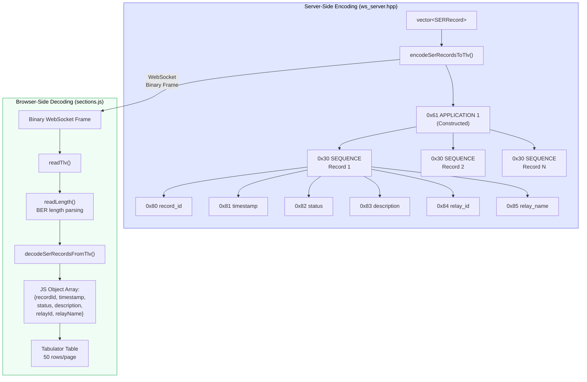

---

## 7. WebSocket to UI — Detailed Data Flow

### 7A. Complete Pipeline: Server → Ring Buffer → Decode → Table

```mermaid
flowchart TD
    subgraph SERVER["C++ Server (ws_server.hpp)"]
        direction TB
        DBQUERY["db_.getAllRecords()<br/>SELECT * FROM ser_records<br/>ORDER BY timestamp DESC"]
        DBQUERY --> ENCODE["asn_tlv::encodeSerRecordsToTlv()"]

        subgraph TLV_STRUCT["Binary TLV Structure"]
            direction TB
            T61["0x61 APPLICATION 1 (Constructed)"]
            T61 --> T30a["0x30 SEQUENCE - Record 1"]
            T61 --> T30b["0x30 SEQUENCE - Record 2"]
            T61 --> T30n["0x30 SEQUENCE - Record N"]
            T30a --> F80["0x80 record_id"]
            T30a --> F81["0x81 timestamp"]
            T30a --> F82["0x82 status"]
            T30a --> F83["0x83 description"]
            T30a --> F84["0x84 relay_id"]
            T30a --> F85["0x85 relay_name"]
        end

        ENCODE --> TLV_STRUCT
        TLV_STRUCT --> BCAST["sessionMgr_.getSessions()<br/>→ session->sendBroadcast(payload)"]
        BCAST --> WSBINARY["WebSocket Binary Frame<br/>ws_.binary(true)<br/>ws_.async_write()"]
    end

    subgraph WORKER["ser_worker.js (Web Worker Thread)"]
        direction TB
        WS_RECV["ws.onmessage(event)"]
        WS_RECV --> TYPE_CHECK{"data instanceof<br/>ArrayBuffer?"}

        TYPE_CHECK -->|"Yes (Binary)"| RING_WRITE["ring.writePayload(<br/>new Uint8Array(data))"]
        TYPE_CHECK -->|"No (Text)"| POST_TEXT["postMessage(<br/>{type:'ws_text', data})"]

        subgraph RING_WRITE_DETAIL["Ring Buffer Write (ring_buffer.js)"]
            direction TB
            RW1["Load writePos from header[0]<br/>(Atomics.load)"]
            RW1 --> RW2["Check capacity:<br/>payload + 4 bytes header"]
            RW2 --> RW3{"Enough space?"}
            RW3 -->|"No"| RW4["dropOldestForSlowest()<br/>Evict oldest for slowest reader"]
            RW3 -->|"Yes"| RW5["Write 4-byte LE length<br/>+ payload bytes"]
            RW4 --> RW5
            RW5 --> RW6["Atomics.store(header, 0, newWritePos)"]
            RW6 --> RW7["Atomics.add(header, 1, 1)<br/>Increment signal counter"]
            RW7 --> RW8["Atomics.notify(header, 1, 1)<br/>Wake sleeping readers"]
        end

        RING_WRITE --> RING_WRITE_DETAIL
    end

    subgraph SHARED_MEM["SharedArrayBuffer (512 KB)"]
        direction LR
        HEAD["Header (44 bytes)<br/>Int32[0]: writePos<br/>Int32[1]: signal<br/>Int32[2]: readerCount<br/>Int32[3..10]: per-reader readPos"]
        DATA["Data Ring<br/>[4-byte len][payload][4-byte len][payload]..."]
    end

    subgraph MAIN_THREAD["sections.js (Main UI Thread)"]
        direction TB
        ATOMIC_WAIT["Atomics.waitAsync(header, 1, lastSignal)<br/>Zero-CPU wait until signal changes"]
        ATOMIC_WAIT --> WAKE["Signal changed → Wake up"]
        WAKE --> DRAIN["Drain loop:<br/>payload = serRing.readPayload(serReaderId)"]

        subgraph RING_READ_DETAIL["Ring Buffer Read (ring_buffer.js)"]
            direction TB
            RR1["Load readPos from header[3 + readerId]"]
            RR1 --> RR2["Load writePos from header[0]"]
            RR2 --> RR3{"readPos == writePos?"}
            RR3 -->|"Yes"| RR4["return null (no data)"]
            RR3 -->|"No"| RR5["Read 4-byte LE length at readPos"]
            RR5 --> RR6["Slice payload: data[pos+4 .. pos+4+len]"]
            RR6 --> RR7["Atomics.store(header, 3+readerId, newReadPos)"]
            RR7 --> RR8["return Uint8Array payload"]
        end

        DRAIN --> RING_READ_DETAIL

        RING_READ_DETAIL --> DECODE["decodeSerRecordsFromTlv(payload)"]

        subgraph DECODE_STEPS["TLV Decode Pipeline"]
            direction TB
            D1["Read top-level: tag=0x61"]
            D1 --> D2["Loop: Read each 0x30 SEQUENCE"]
            D2 --> D3["For each record, read fields:<br/>0x80→recordId, 0x81→timestamp<br/>0x82→status, 0x83→description<br/>0x84→relayId, 0x85→relayName"]
            D3 --> D4["TextDecoder.decode(bytes) → string"]
            D4 --> D5["Split timestamp → date + time"]
            D5 --> D6["Build JS object:<br/>{sno, date, time, element, state,<br/>relayId, relayName}"]
        end

        DECODE --> DECODE_STEPS

        DECODE_STEPS --> FILTER["Filter by current relay ID:<br/>record.relayId === relay.id"]
        FILTER --> UPDATE["updateSerTable(records)"]

        subgraph TABLE_UPDATE["Table Update Logic"]
            direction TB
            U1{"serTable exists?"}
            U1 -->|"No"| U2["initSerTable(data)<br/>Create new Tabulator"]
            U1 -->|"Yes"| U3["Deduplicate:<br/>newRows = data.filter(<br/>r => !serKnownSnos.has(r.sno))"]
            U3 --> U4{"newRows.length > 0?"}
            U4 -->|"Yes"| U5["serTable.blockRedraw()<br/>serTable.addData(newRows)<br/>serKnownSnos.add(each sno)<br/>serTable.restoreRedraw()"]
            U4 -->|"No"| U6["Skip (no new data)"]
        end

        UPDATE --> TABLE_UPDATE
        TABLE_UPDATE --> STATS["updateSerStats()<br/>Count: N | Updated: HH:MM:SS"]
    end

    subgraph UI["Browser DOM (#ser-table)"]
        direction TB
        TABULATOR["Tabulator Table"]

        subgraph COLUMNS["Columns"]
            direction LR
            C1["S.No<br/>(recordId)"]
            C2["Date"]
            C3["Time"]
            C4["Element<br/>(description)"]
            C5["State<br/>(status)"]
        end

        TABULATOR --> COLUMNS

        subgraph FORMATTER["serStatusFormatter()"]
            direction TB
            F1{"value?"}
            F1 -->|"Asserted"| F2["ser-status--assert<br/>Green badge"]
            F1 -->|"Deasserted"| F3["ser-status--deassert<br/>Red badge"]
            F1 -->|"Other"| F4["Plain text"]
        end

        C5 --> FORMATTER

        PAGINATION["Pagination: 50 rows/page<br/>Selectable: 10, 20, 50, 100"]
        SORT["Default sort: S.No DESC<br/>(newest first)"]
    end

    %% Connections between subgraphs
    WSBINARY -->|"TCP :8765"| WS_RECV
    RING_WRITE_DETAIL -->|"Shared Memory<br/>Zero-Copy"| SHARED_MEM
    SHARED_MEM -->|"Atomic Signal<br/>Wake Reader"| ATOMIC_WAIT
    TABLE_UPDATE --> TABULATOR

    style SERVER fill:#e0e7ff,stroke:#4f46e5,color:#000
    style WORKER fill:#fef3c7,stroke:#d97706,color:#000
    style SHARED_MEM fill:#fce7f3,stroke:#db2777,color:#000
    style MAIN_THREAD fill:#f0fdf4,stroke:#16a34a,color:#000
    style UI fill:#fff7ed,stroke:#ea580c,color:#000
    style TLV_STRUCT fill:#ede9fe,stroke:#7c3aed,color:#000
    style DECODE_STEPS fill:#ecfdf5,stroke:#059669,color:#000
    style TABLE_UPDATE fill:#fefce8,stroke:#ca8a04,color:#000
    style RING_WRITE_DETAIL fill:#fef9c3,stroke:#a16207,color:#000
    style RING_READ_DETAIL fill:#d1fae5,stroke:#047857,color:#000
```

---

### 7B. Fallback Path: Direct WebSocket (No SharedArrayBuffer)

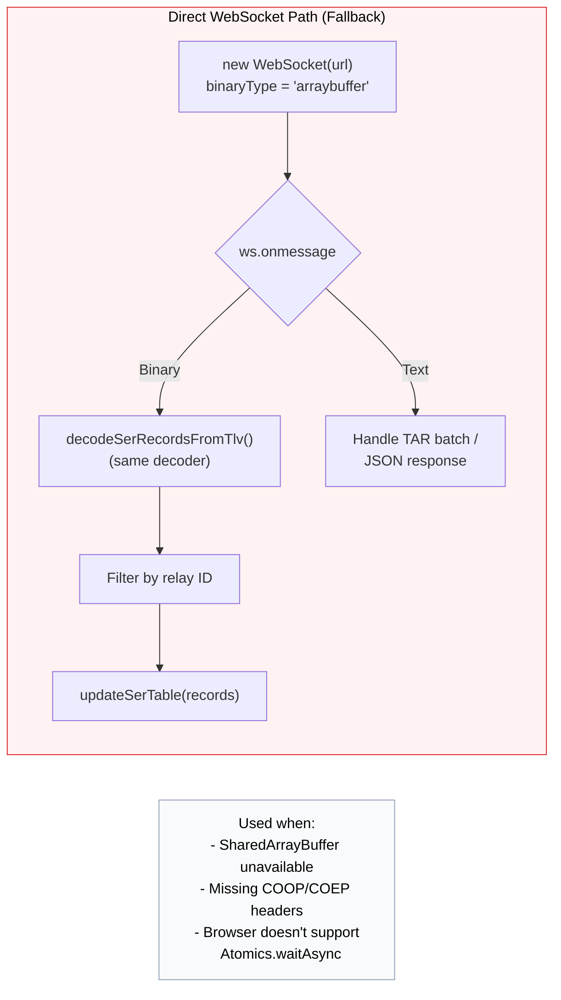

---

### 7C. Auto-Reconnect & Status Flow

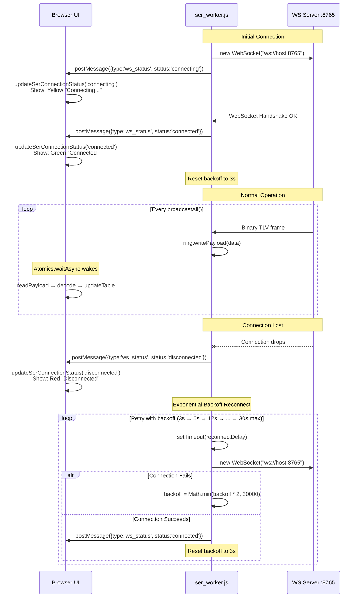

---

### 7D. User Command Flow: UI → Server → Relay → UI

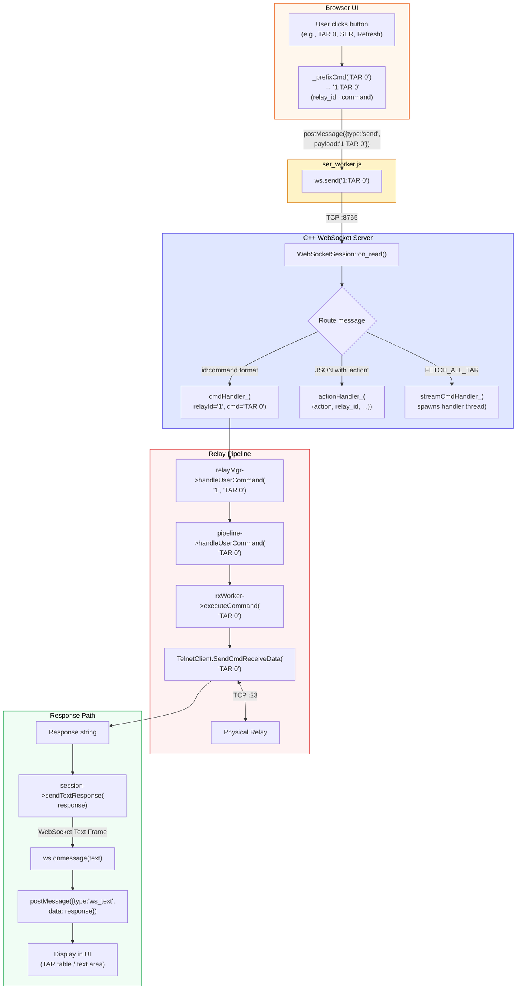

---

### 7E. Data Type Summary

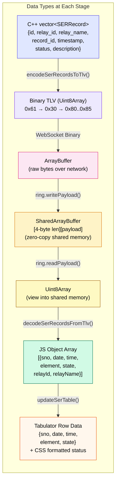

---

## 8. Complete System Lifecycle

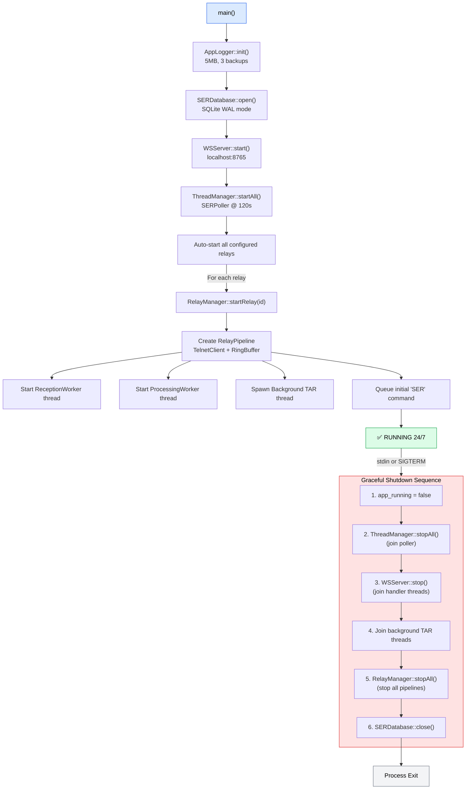
