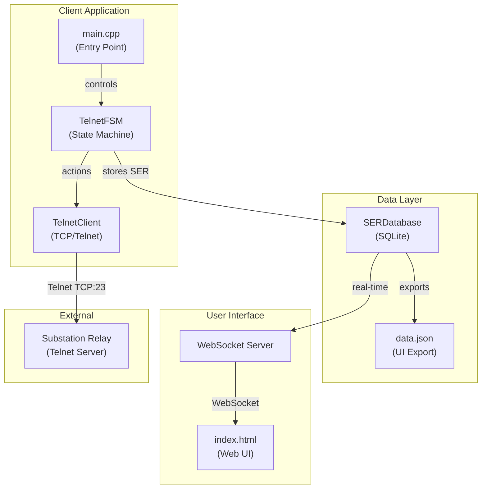

# Telnet FSM Implementation - Detailed Explanation

## Architecture Overview

### Architecture Diagram (Mermaid)



```
┌─────────────┐     ┌─────────────┐     ┌─────────────────┐
│   main.cpp  │────▶│ TelnetFSM   │────▶│  TelnetClient   │
│  (Driver)   │     │ (Boost.SML) │     │  (Boost.Asio)   │
└─────────────┘     └─────────────┘     └─────────────────┘
                                               │
                                               ▼
                                        ┌─────────────────┐
                                        │  SEL-735 Relay  │
                                        │  192.168.0.2:23 │
                                        └─────────────────┘
```

---

## 1. main.cpp - Application Entry Point

```cpp
TelnetClient client;                    // Network communication object

ConnectionConfig conn{                  // Target device
    "192.168.0.2", 23,                 // SEL-735 relay IP:port
    std::chrono::milliseconds(2000)    // Connection timeout
};

LoginConfig creds{ "acc", "OTTER" };   // Credentials

sml::sm<TelnetFSM> fsm{ client, conn, creds };  // Create state machine
fsm.process_event(start_event{});               // Kick off FSM
```

**Main Loop (10 iterations):**
1. Print new responses (with deduplication)
2. Send `step_event` to FSM → triggers state transitions
3. Check for Error state → break if error
4. Sleep 200ms between steps

---

## 2. TelnetClient (client.hpp/cpp) - Network Layer

| Method | Purpose |
|--------|---------|
| `connectCheck()` | Async TCP connect with timeout |
| `SendCmdReceiveData()` | **Core function** - sends command, reads until prompt |
| `LoginLevel1Function()` | Sends username + password |
| `isResponseComplete()` | Checks for prompt or "SER Response Complete" |
| `endsWithPrompt()` | Looks for `>`, `#`, `$`, `:`, `?` in last 30 chars |

**SendCmdReceiveData Flow:**
```
1. Send: "command\r\n"
2. Loop: read chunks (512 bytes)
3. Check: isResponseComplete(buffer)?
   - Yes → return true
   - No → continue reading
4. Timeout after 5 seconds → return false
```

---

## 3. TelnetFSM (telnet_fsm.hpp) - State Machine

**States:**
```
Idle → Connecting → Login_L1 → Operational ⟷ Polling
                        │              │
                        └───▶ Error ◀──┘
```

**Transition Table:**

| Current State | Event | Guard | Next State |
|--------------|-------|-------|------------|
| *Idle | start_event | - | Connecting |
| Connecting | step_event | ConnectOkGuard | Login_L1 |
| Connecting | step_event | ConnectFailGuard | Error |
| Login_L1 | step_event | Login1CompleteGuard | Operational |
| Login_L1 | step_event | Login1FailGuard | Error |
| Operational | step_event | - | Polling |
| Polling | step_event | SerCompleteGuard | Operational |
| Polling | step_event | SerFailGuard | Error |

**Actions (on state entry):**
- `Connecting` → `ConnectAction` → calls `client.connectCheck()`
- `Login_L1` → `Login1Action` → calls `client.LoginLevel1Function()`
- `Polling` → `PollSerAction` → calls `client.SendCmdReceiveData("SER")`

**Guards (conditions to transition):**
- `ConnectOkGuard` → `client.getLastIoResult() == true`
- `Login1CompleteGuard` → IO success + response has prompt
- `SerCompleteGuard` → IO success + response has prompt or "SER Response Complete"

---

## 4. Execution Flow

```
Step 0: start_event → Idle→Connecting (connects to relay)
Step 1: step_event  → Connecting→Login_L1 (sends acc/OTTER)
Step 2: step_event  → Login_L1→Operational (login complete)
Step 3: step_event  → Operational→Polling (sends SER)
Step 4: step_event  → Polling→Operational (SER complete)
Step 5: step_event  → Operational→Polling (sends SER again)
...repeats Operational⟷Polling...
```

---

## 5. Key Design Patterns

| Pattern | Implementation |
|---------|---------------|
| **State Machine** | Boost.SML declarative transitions |
| **Dependency Injection** | FSM receives client, configs at construction |
| **Single Responsibility** | TelnetClient handles networking, FSM handles logic |
| **DRY** | `SendCmdReceiveData` reused by all commands |

---

## 6. Build Command

```powershell
g++ -std=c++17 -I third_party/sml/include -I C:\Development\Libraries\boost_1_90_0 main.cpp client.cpp -o telnet_fsm_test.exe -lws2_32
```

## 7. Run Command

```powershell
.\telnet_fsm_test.exe
```
