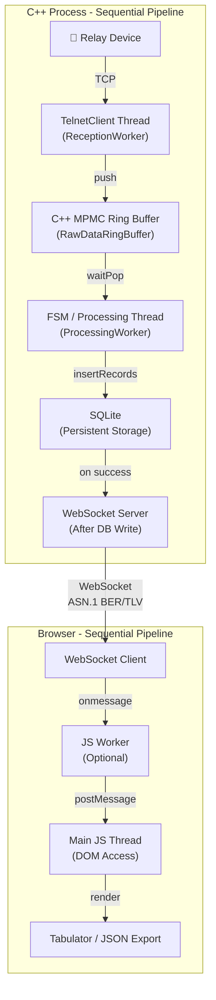
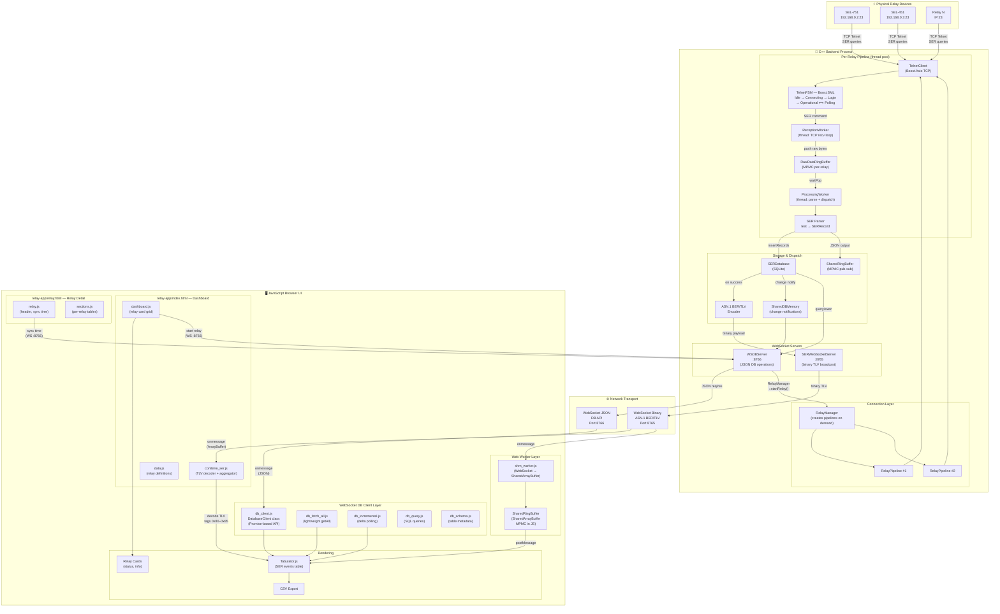
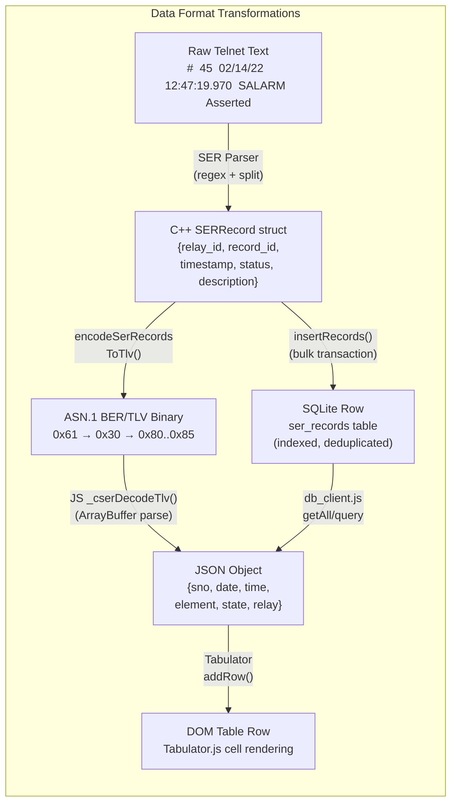
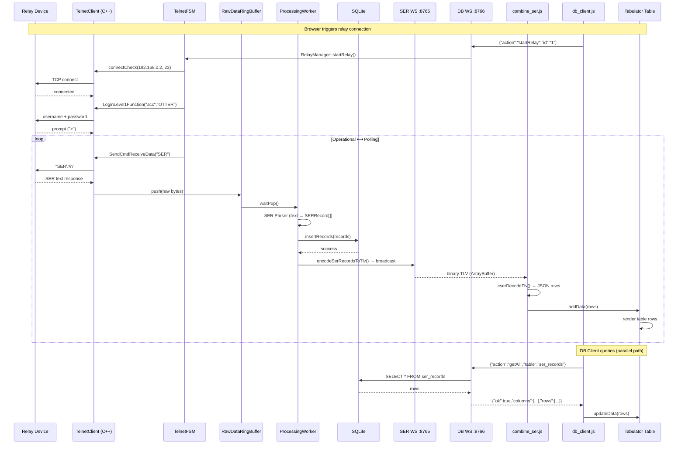

# Telnet FSM Implementation - Detailed Explanation

## Architecture Overview

The process starts when the **Relay device** sends live data over the network, which is received by the **TelnetClient** written in C++. As soon as data is received, it is immediately pushed into a **C++ MPMC ring buffer** (struct-based) to ensure the reception path remains non-blocking and lightweight.

A separate **processing thread** continuously reads from this ring buffer and forwards the data to the **FSM (Finite State Machine)** for validation and business logic handling. After processing, the validated data is written to **SQLite** for persistence and **then** emitted through the **WebSocket server** for real-time browser updates (only after successful DB write).

On the browser side, the **WebSocket Client** receives the live messages. If additional parsing or heavy computation is required, a **JavaScript Worker** can handle that workload to avoid blocking the UI thread. The worker writes processed data into a **Shared Ring Buffer** (using SharedArrayBuffer), and the **main JavaScript thread** reads from this buffer to update the DOM (since only the main thread has DOM access).

Finally, the main thread updates the **Tabulator table** to reflect real-time changes.

### C++ Process Architecture

```
Relay Device
     ↓
TelnetClient Thread (C++)
     ↓
C++ MPMC Ring Buffer
     ↓
FSM / Processing Thread
     ↓
SQLite (Persistent Storage)
     ↓
WebSocket Server (After DB Write)
```

### Browser Architecture

```
WebSocket Client
     ↓
JS Worker (Optional)
     ↓
Main JS Thread (DOM Access)
     ↓
Tabulator / JSON Export
```

### Architecture Diagram (Mermaid)



```
C++ PROCESS                                    BROWSER
┌─────────────────┐                           ┌─────────────────┐
│   Relay Device  │                           │ WebSocket Client│
│  192.168.0.2:23 │                           └────────┬────────┘
└────────┬────────┘                                    │
         │ TCP                                         ▼
         ▼                                    ┌─────────────────┐
┌─────────────────┐                           │   JS Worker     │
│ TelnetClient    │                           │   (Optional)    │
│ Thread (C++)    │                           └────────┬────────┘
└────────┬────────┘                                    │
         │ push                                        ▼
         ▼                                    ┌─────────────────┐
┌─────────────────┐                           │ Main JS Thread  │
│ C++ MPMC Ring   │                           │  (DOM Access)   │
│ Buffer          │                           └────────┬────────┘
└────────┬────────┘                                    │
         │ waitPop                                     ▼
         ▼                                    ┌─────────────────┐
┌─────────────────┐                           │   Tabulator /   │
│ FSM/Processing  │                           │   JSON Export   │
│ Thread          │                           └─────────────────┘
└────────┬────────┘
         │ insertRecords
         ▼
┌─────────────────┐
│     SQLite      │
│   (Persistent)  │
└────────┬────────┘
         │ on success
         ▼
┌─────────────────┐
│ WebSocket Server│──────────────────────────▶ (to Browser)
│ (After DB Write)│        ASN.1 BER/TLV
└─────────────────┘
```

---

## 1. main.cpp - Application Entry Point

```cpp
TelnetClient client;                    // Network communication object

ConnectionConfig conn{                  // Target device
    "192.168.0.2", 23,                 // SEL-735 relay IP:port
    std::chrono::milliseconds(2000)    // Connection timeout
};

LoginConfig creds{ "acc", "OTTER" };   // Credentials

sml::sm<TelnetFSM> fsm{ client, conn, creds };  // Create state machine
fsm.process_event(start_event{});               // Kick off FSM
```

**Main Loop (10 iterations):**
1. Print new responses (with deduplication)
2. Send `step_event` to FSM → triggers state transitions
3. Check for Error state → break if error
4. Sleep 200ms between steps

---

## 2. TelnetClient (client.hpp/cpp) - Network Layer

| Method | Purpose |
|--------|---------|
| `connectCheck()` | Async TCP connect with timeout |
| `SendCmdReceiveData()` | **Core function** - sends command, reads until prompt |
| `LoginLevel1Function()` | Sends username + password |
| `isResponseComplete()` | Checks for prompt or "SER Response Complete" |
| `endsWithPrompt()` | Looks for `>`, `#`, `$`, `:`, `?` in last 30 chars |

**SendCmdReceiveData Flow:**
```
1. Send: "command\r\n"
2. Loop: read chunks (512 bytes)
3. Check: isResponseComplete(buffer)?
   - Yes → return true
   - No → continue reading
4. Timeout after 5 seconds → return false
```

---

## 3. TelnetFSM (telnet_fsm.hpp) - State Machine

**States:**
```
Idle → Connecting → Login_L1 → Operational ⟷ Polling
                        │              │
                        └───▶ Error ◀──┘
```

**Transition Table:**

| Current State | Event | Guard | Next State |
|--------------|-------|-------|------------|
| *Idle | start_event | - | Connecting |
| Connecting | step_event | ConnectOkGuard | Login_L1 |
| Connecting | step_event | ConnectFailGuard | Error |
| Login_L1 | step_event | Login1CompleteGuard | Operational |
| Login_L1 | step_event | Login1FailGuard | Error |
| Operational | step_event | - | Polling |
| Polling | step_event | SerCompleteGuard | Operational |
| Polling | step_event | SerFailGuard | Error |

**Actions (on state entry):**
- `Connecting` → `ConnectAction` → calls `client.connectCheck()`
- `Login_L1` → `Login1Action` → calls `client.LoginLevel1Function()`
- `Polling` → `PollSerAction` → calls `client.SendCmdReceiveData("SER")`

**Guards (conditions to transition):**
- `ConnectOkGuard` → `client.getLastIoResult() == true`
- `Login1CompleteGuard` → IO success + response has prompt
- `SerCompleteGuard` → IO success + response has prompt or "SER Response Complete"

---

## 4. Execution Flow

```
Step 0: start_event → Idle→Connecting (connects to relay)
Step 1: step_event  → Connecting→Login_L1 (sends acc/OTTER)
Step 2: step_event  → Login_L1→Operational (login complete)
Step 3: step_event  → Operational→Polling (sends SER)
Step 4: step_event  → Polling→Operational (SER complete)
Step 5: step_event  → Operational→Polling (sends SER again)
...repeats Operational⟷Polling...
```

---

## 5. Key Design Patterns

| Pattern | Implementation |
|---------|---------------|
| **State Machine** | Boost.SML declarative transitions |
| **Dependency Injection** | FSM receives client, configs at construction |
| **Single Responsibility** | TelnetClient handles networking, FSM handles logic |
| **DRY** | `SendCmdReceiveData` reused by all commands |

---

## 6. Build Command

```powershell
g++ -std=c++17 -I third_party/sml/include -I C:\Development\Libraries\boost_1_90_0 main.cpp client.cpp -o telnet_fsm_test.exe -lws2_32
```

## 7. Run Command

```powershell
.\telnet_fsm_test.exe
```

---

## 8. C++ & JavaScript Combined Data Flow — Relay to UI

### Overview

The system follows a **pipeline architecture** where physical relay devices feed data through a multi-threaded C++ backend, across WebSocket channels, and into a JavaScript browser UI for real-time visualization.

### Full Data Flow Diagram (Mermaid)



### Data Format Flow



### Communication Channels

| Channel | Port | Protocol | Direction | Payload | Used By |
|---------|------|----------|-----------|---------|---------|
| Telnet | 23 | TCP | C++ → Relay | SER text commands | TelnetClient |
| SER WebSocket | 8765 | WS Binary | C++ → Browser | ASN.1 BER/TLV records | combine_ser.js, shm_worker.js |
| DB WebSocket | 8766 | WS JSON | Browser ↔ C++ | getAll, query, exec, schema | db_client.js, dashboard.js |
| SharedRingBuffer | IPC | Shared Memory | C++ → C++ / JS Worker | Binary TLV / JSON | shm_worker.js |
| SharedDBMemory | IPC | Shared Memory | C++ → C++ | Change notifications | WSDBServer |

### ASN.1 TLV Binary Wire Format

```
┌──────────────────────────────────────────────────────────────┐
│ Tag: 0x61 (APPLICATION 1, constructed)                       │
│ Length: N bytes                                               │
│ ┌──────────────────────────────────────────────────────────┐ │
│ │ Tag: 0x30 (SEQUENCE) ─ Record #1                        │ │
│ │ ┌────────────────────────────────────────────────────┐   │ │
│ │ │ 0x80 │ len │ record_id   ("45")                    │   │ │
│ │ │ 0x81 │ len │ timestamp   ("02/14/22 12:47:19.970") │   │ │
│ │ │ 0x82 │ len │ status      ("Asserted")              │   │ │
│ │ │ 0x83 │ len │ description ("SALARM")                │   │ │
│ │ │ 0x84 │ len │ relay_id    ("1")                     │   │ │
│ │ │ 0x85 │ len │ relay_name  ("SEL-751")               │   │ │
│ │ └────────────────────────────────────────────────────┘   │ │
│ │ Tag: 0x30 (SEQUENCE) ─ Record #2 ...                    │ │
│ └──────────────────────────────────────────────────────────┘ │
└──────────────────────────────────────────────────────────────┘
```

### End-to-End Sequence


